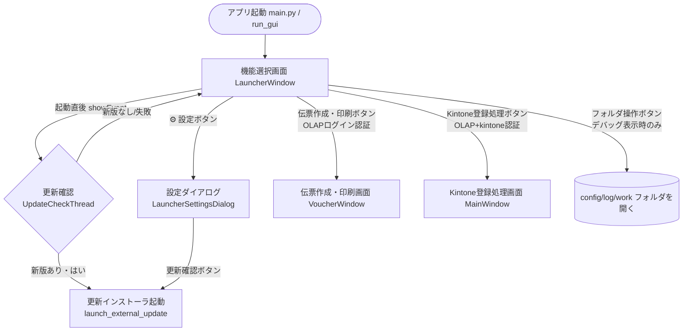
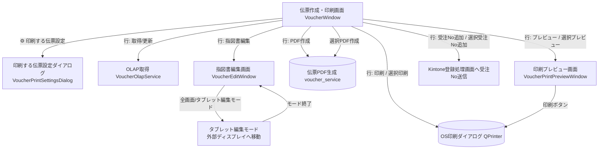
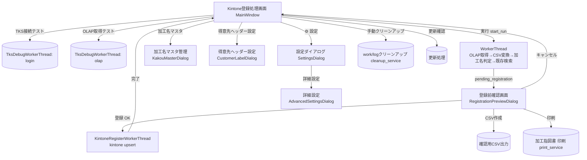
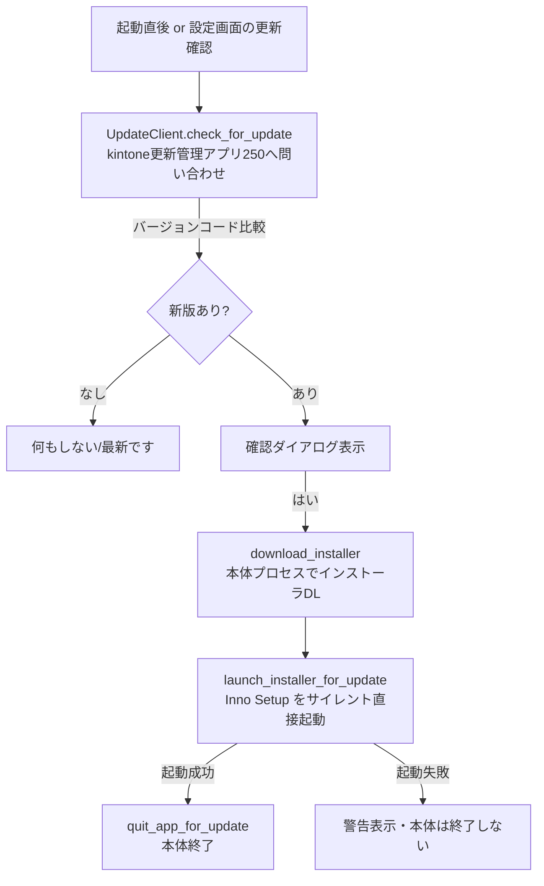

# 画面遷移図

対象アプリ：**TKS OLAP to kintone**（バージョン 1.6.1 / バージョンコード 45）
作成範囲：リポジトリ全体（`app/` 配下の PySide6 GUI を中心に解析）

> 本書はソースコードから確認できた遷移のみを記載する。コードから断定できない箇所には「推測」と明記する。

---

## 1. 全体構成の概要

本アプリは PySide6（Qt）製のデスクトップアプリで、起動するとまず **機能選択画面（`LauncherWindow`）** が表示される。
機能選択画面から、用途に応じて以下の2系統の機能へ分岐する。

- **伝票作成・印刷**（`VoucherWindow`） … OLAPから伝票データを取得し、伝票PDFの作成・プレビュー・印刷・指図書編集を行う。
- **Kintone登録処理**（`MainWindow`） … OLAP取得 → CSV変換 → 登録前確認 → kintone登録 を行う。

エントリポイントは `app/main.py` → `app.gui.run_gui()`。`run_gui()` が `QApplication` を生成し `LauncherWindow` を表示する。

根拠ファイル：`app/main.py`、`app/gui.py`（`run_gui`）、`app/launcher_window.py`

---

## 2. 画面遷移 Mermaid 図

### 2.1 起動〜機能選択〜主要画面

### 2.2 伝票作成・印刷画面からの遷移

### 2.3 Kintone登録処理画面からの遷移

---

## 3. 遷移一覧表

### 3.1 機能選択画面（`LauncherWindow`）起点

| 遷移元 | 操作 | 遷移先 | 主な処理 | 関連ファイル | 関連クラス／関数 |
| --- | --- | --- | --- | --- | --- |
| 機能選択画面 | 起動直後（`showEvent`） | （更新確認） | バックグラウンドで最新版を確認。新版なし時は通知しない | `app/launcher_window.py` | `_check_update_once_after_show` / `_UpdateCheckThread` |
| 機能選択画面 | 「⚙」ボタン | 設定ダイアログ | テーマ・デバッグ表示・バージョン情報・更新確認 | `app/launcher_window.py` | `_open_settings` / `LauncherSettingsDialog` |
| 機能選択画面 | 「伝票作成・印刷」 | 伝票作成・印刷画面 | OLAPログイン認証 → 成功でOLAP資格情報保存 → `VoucherWindow` 起動 | `app/launcher_window.py` | `_open_voucher` / `_authorize_olap` / `_launch_voucher_window` |
| 機能選択画面 | 「Kintone登録処理」 | Kintone登録処理画面 | OLAPログイン＋kintone接続確認 → 両資格情報保存 → `MainWindow` 起動 | `app/launcher_window.py`, `app/gui.py` | `_open_kintone` / `_authorize_kintone` / `_launch_kintone_window` |
| 機能選択画面 | 設定フォルダ/ログ/workフォルダを開く（デバッグ表示時のみ） | OSのファイラ | 対象フォルダを `QDesktopServices` で開く | `app/launcher_window.py` | `open_folder` |
| 機能選択画面 | 画面を閉じる | アプリ終了 | 子画面を閉じて `QApplication.quit()` | `app/launcher_window.py` | `closeEvent` |

> 補足：OLAP/kintoneのID・パスワードが未入力だと「伝票作成・印刷」「Kintone登録処理」ボタンは無効（`_update_buttons`）。子画面起動中は対応する入力欄をロックする（`_update_credential_locks`）。

### 3.2 伝票作成・印刷画面（`VoucherWindow`）起点

| 遷移元 | 操作 | 遷移先 | 主な処理 | 関連ファイル | 関連クラス／関数 |
| --- | --- | --- | --- | --- | --- |
| 伝票作成・印刷画面 | 「⚙（印刷する伝票設定）」 | 印刷する伝票設定ダイアログ | 既定印刷伝票・OLAP/一覧の保存期間を設定 | `app/voucher_window.py` | `_on_voucher_settings` / `VoucherPrintSettingsDialog` |
| 伝票作成・印刷画面 | 行「取得」 | （OLAP取得） | 受注NoでOLAP取得、行へ保持・キャッシュ更新 | `app/voucher_window.py`, `app/voucher_olap_service.py` | `_on_refetch_row` / `_build_print_data` |
| 伝票作成・印刷画面 | 行「指図書編集」 | 指図書編集画面 | 指図書(1)プレビュー生成（編集オブジェクト無し背景）→ `VoucherEditWindow` を最大化表示 | `app/voucher_window.py`, `app/voucher_edit_window.py` | `_on_edit_order_sheet` |
| 伝票作成・印刷画面 | 行「PDF作成」/「選択PDF作成」 | （PDF生成・保存） | 伝票PDFを生成し出力先へ保存、開く | `app/voucher_window.py`, `app/voucher_service.py` | `_on_pdf` / `_on_select_pdf` / `_create_pdf` |
| 伝票作成・印刷画面 | 行「プレビュー」/「選択プレビュー」 | 印刷プレビュー画面 | PDFバイト列を生成し `VoucherPrintPreviewWindow` を開く | `app/voucher_window.py`, `app/voucher_preview_window.py` | `_on_preview` / `_open_preview_window` |
| 伝票作成・印刷画面 | 行「印刷」/「選択印刷」 | OS印刷ダイアログ | PDFを生成しプレビュー経由でQPrinterへ | `app/voucher_window.py` | `_on_print` / `_on_select_print` |
| 伝票作成・印刷画面 | 行「受注No追加」/「選択受注No追加」 | Kintone登録処理画面 | 受注NoをKintone登録処理画面の入力欄へ追加 | `app/voucher_window.py`, `app/gui.py` | `_on_kintone_register` / `MainWindow.add_order_no` |
| 伝票作成・印刷画面 | 画面を閉じる | 機能選択画面へ復帰 | `back_requested` シグナル発火 → ランチャー前面化 | `app/voucher_window.py` | `closeEvent` / `back_requested` |

### 3.3 印刷プレビュー画面（`VoucherPrintPreviewWindow`）起点

| 遷移元 | 操作 | 遷移先 | 主な処理 | 関連ファイル | 関連クラス／関数 |
| --- | --- | --- | --- | --- | --- |
| 印刷プレビュー画面 | 「印刷」 | OS印刷ダイアログ | `QPrintDialog`/`QPrinter` で印刷実行 | `app/voucher_preview_window.py` | `_on_print` |
| 印刷プレビュー画面 | 拡大/縮小/等倍 | （同画面・ズーム変更） | ピクスマップを再スケール | `app/voucher_preview_window.py` | `_on_zoom_in` / `_on_zoom_out` / `_on_zoom_reset` |

### 3.4 指図書編集画面（`VoucherEditWindow`）起点

| 遷移元 | 操作 | 遷移先 | 主な処理 | 関連ファイル | 関連クラス／関数 |
| --- | --- | --- | --- | --- | --- |
| 指図書編集画面 | 全画面切替 | 全画面表示 | フルスクリーン切替 | `app/voucher_edit_window.py` | `toggle_fullscreen` |
| 指図書編集画面 | タブレット編集モード | タブレット編集モード | 外部ディスプレイへ移動・大ボタンUI表示 | `app/voucher_edit_window.py` | `prompt_and_enter_tablet_mode` / `enter_tablet_mode` |
| 指図書編集画面 | ディスプレイ選択 | ディスプレイ選択ダイアログ | 移動先 `QScreen` を選択 | `app/voucher_edit_window.py` | `_select_tablet_screen` / `TabletScreenDialog` |
| 指図書編集画面 | しきい値設定 | しきい値設定ダイアログ | 画像透過のRGBしきい値を調整 | `app/voucher_edit_window.py` | `_on_threshold_settings` / `ThresholdSettingsDialog` |
| 指図書編集画面 | テンプレート登録 | テンプレート登録ダイアログ | 反映先伝票テンプレートを登録 | `app/voucher_edit_window.py` | `_on_register_template` / `_TemplateRegisterDialog` |
| 指図書編集画面 | 保存して閉じる/閉じる | 伝票作成・印刷画面へ復帰 | オブジェクトをJSON保存（未保存確認あり） | `app/voucher_edit_window.py` | `save_and_close` / `closeEvent` / `_prompt_unsaved_changes` |

### 3.5 タブレット編集モード

| 遷移元 | 操作 | 遷移先 | 主な処理 | 関連ファイル | 関連クラス／関数 |
| --- | --- | --- | --- | --- | --- |
| 指図書編集画面 | タブレット編集モード起動 | タブレット編集モード | 外部ディスプレイへウィンドウ移動、タブレット用ツールバー・レイヤーパネル表示 | `app/voucher_edit_window.py` | `enter_tablet_mode` / `_build_tablet_toolbar` |
| タブレット編集モード | モード終了 | 指図書編集画面（通常） | 元ディスプレイへ復帰、通常ツールバー再表示 | `app/voucher_edit_window.py` | `exit_tablet_mode` / `toggle_tablet_mode` |

> 編集データ（オブジェクト・手書きレイヤー）は通常モードとタブレットモードで共有される。

### 3.6 Kintone登録処理画面（`MainWindow`）起点

| 遷移元 | 操作 | 遷移先 | 主な処理 | 関連ファイル | 関連クラス／関数 |
| --- | --- | --- | --- | --- | --- |
| Kintone登録処理画面 | 「実行」 | 登録前確認画面 | OLAPログイン→CSV取得→変換→加工名判定→既存検索→確認画面表示 | `app/gui.py` | `start_run` / `WorkerThread.run` / `on_pending_registration` |
| 登録前確認画面 | 「登録」OK | （kintone登録） | upsert登録、失敗時は失敗CSV出力 | `app/gui.py`, `app/kintone_client.py` | `KintoneRegisterWorkerThread.run` / `register_rows` |
| 登録前確認画面 | 「CSV作成」 | （CSV出力） | 登録用データを確認用CSVへ出力（送信なし） | `app/gui.py` | `RegistrationPreviewDialog._on_create_csv` |
| 登録前確認画面 | 「印刷」 | （加工指図書印刷） | A4横モノクロで加工指図書を印刷 | `app/gui.py`, `app/print_service.py` | `_print_slips` / `print_order_slips` |
| Kintone登録処理画面 | 「加工名マスタ」 | 加工名マスタ管理 | マスタCSVの編集・バックアップ・取込・既定戻し | `app/gui.py` | `open_kakou_master` / `KakouMasterDialog` |
| Kintone登録処理画面 | 「得意先ヘッダー設定」 | 得意先ヘッダー設定 | 得意先1〜4の表示名・判定文字列を編集 | `app/gui.py` | `open_customer_label_settings` / `CustomerLabelDialog` |
| Kintone登録処理画面 | 「⚙ 設定」 | 設定ダイアログ | テーマ・Webhook・登録先などの設定 | `app/gui.py` | `open_settings` / `SettingsDialog` / `AdvancedSettingsDialog` |
| Kintone登録処理画面 | 「TKS接続テスト」 | （デバッグ実行） | TKSログインのみ実行 | `app/gui.py` | `start_tks_login_test` / `TksDebugWorkerThread` |
| Kintone登録処理画面 | 「OLAP取得テスト」 | （デバッグ実行） | OLAP取得のみ実行 | `app/gui.py` | `start_olap_test` |
| Kintone登録処理画面 | 「更新確認」 | （更新処理） | 手動で更新確認・適用 | `app/gui.py` | `start_manual_update_check` / `start_update_download` |
| Kintone登録処理画面 | 各フォルダを開く（デバッグ表示時のみ） | OSのファイラ | config/log/work を開く | `app/gui.py` | `open_folder` |

---

## 4. 更新処理の流れ

根拠ファイル：`app/update_client.py`、`app/launcher_window.py`（`_prompt_and_start_update`）、`app/gui.py`（`quit_app_for_update`）

> PowerShell や外部ヘルパーEXEを使わず、本体プロセスでダウンロード→インストーラ直接起動する方式（`app/update_client.py` 冒頭コメント参照）。`app/update_helper.py` は別系統（`with-helper` ビルド）の補助プロセス。詳細は[外部連携仕様.md](外部連携仕様.md)を参照。

---

## 5. 注意点（遷移に関わる仕様）

- 機能選択画面は子画面（伝票/Kintone）を**1つずつ**しか開けない（同一画面はボタン無効化、起動済みなら前面化）。
- 伝票画面とKintone登録処理画面が両方開いている場合、受注No変更・登録完了をシグナルで相互同期する（`_connect_kintone_voucher_sync`）。
- 二重起動要求時は `activate_existing_instance` で既存ウィンドウを前面化する（`run_gui` 内の単一インスタンス制御。推測：`QLocalServer`等の仕組みは未確認）。
